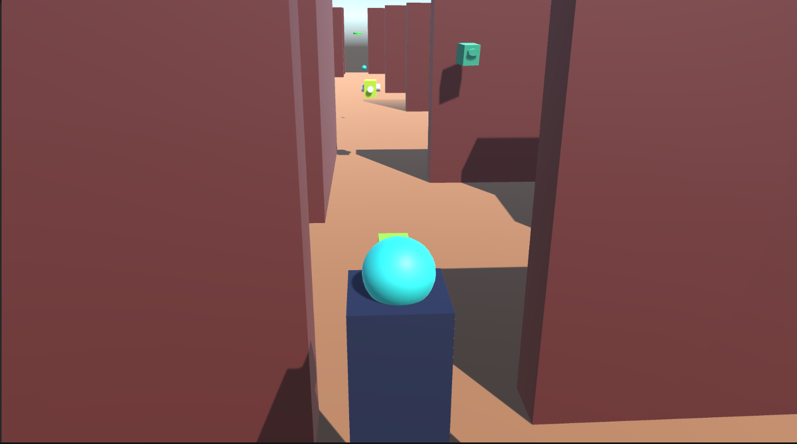

## Scaping Maze

This is a Maze game project built using  Unity 3D and C#.

This game is part of a project for FDU University for  Computer Game Programming course. The game contains two levels (by the moment) and the main ojective of this is get the Green Goal.

## Here you can find a Document where explains how to play it.
[Here](https://www.eduardoflores.name/scapemaze/game_summary.zip)

## Here you can find the exec game
[Here](https://www.eduardoflores.name/scapemaze/game.zip)

## Project Features
1. Player
2. Levels
3. Maze 
4. Sounds (Win or Die)
5. Enemies (Patrollers, Projectils, Weapons, Shooters)
6. Materials
7. etc

## Tool Required:
- Unity 3D (Unity 2022.3.9)
- Visual Studio Code or Visual Studio
- Cinemachine (May be required)

## Getting Started

### 1. Clone the Repository

git clone https://github.com/laloohflorescruz/ScapingMaze.git

 
## 1. Open Unity and find the folder project
-Select scene "main" on the project 

## 2. Run the project

## Project Structure

- **ScapingMaze/**
  - **Assets/** - Contains assets and resources used in the project.
  - **img/** - Contains games' print screens. 
  - **Library/** - Contains ts a system-generated folder that stores various metadata and cached information to improve the performance of the Unity Editor.
  - **Logs/** - Contains his file contains various information, including editor startup details, error messages, warnings, and log messages generated by your scripts or the Unity Editor itself.
  - **Packages/** - Contains additional features, tools, and assets provided by Unity or third-party developers, allowing developers to extend and enhance their projects with pre-made functionalities and resources.
  - **ProjectSettings/** - Contains  various configuration files and settings specific to the project, including editor preferences, input configurations, physics settings.
  - **UserSettings** - Configuration for the user (developper).

## Characters Pictures
 

## Scenarios Pictures

## Contributing
Feel free to contribute to the development of this project by opening issues or pull requests. Your feedback is highly appreciated!

